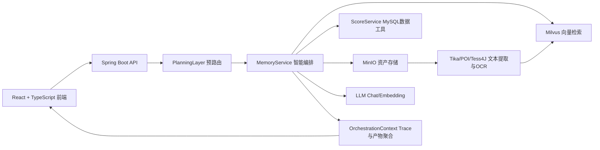

# 校园数字化记忆引擎（CDAME）

让校园记忆“会说话”、让知识资产“能生长”的智能中枢系统。  
面向“校史资料 + 荣誉档案 + 学业数据 + 智能问答”全场景，CDAME 以 AI 为引擎，把分散在文档、图片、音视频与结构化数据中的校园知识，重构为可检索、可追溯、可解释、可持续演进的数字记忆网络。

## 1. 项目定位

CDAME（Campus Digital AI Memory Engine）不仅是一个检索系统，更是一套面向高校的“数字文化操作系统”。  
它融合 **RAG 检索增强生成**、**多模态资源管理** 与 **RBAC 权限控制**，在“技术可落地”与“文化可传承”之间建立统一底座，核心价值是：

- 让校史与多媒体资料从“静态陈列”升级为“可交互知识资产”
- 让 AI 回答从“只给结论”升级为“结论 + 证据 + 来源”的可信表达
- 让游客、学生、教师、管理员在同一平台实现“统一入口、分级可见、安全可控”
- 让学业数据与文档知识打通，形成“检索、分析、决策”一体化体验

## 2. 核心能力

- 智能问答：基于语义检索 + 数据工具调用的混合编排
- 文档与媒体检索：支持 PDF/Office/图片/音视频/外链资源
- 荣誉树：荣誉事件聚合展示与叙事生成
- 学业洞察：成绩统计、专业维度分析、学生个体画像
- 资源生命周期管理：上传、预览、同步、删除一致性
- 权限隔离：guest/student/teacher/admin 多角色安全访问
- 可观测追踪：返回 trace 信息（意图、阈值、召回量、工具链等）
- Whisper 语音链路：支持本地 CLI / 远程 API 双模式、麦克风录音转写、输入框回填后再发起问答
- 摄像头扫描链路：管理员扫描入公共库、教师/学生扫描入私有空间，支持取景框、拍照预览、重拍与确认上传
- OCR 质量门禁：拍照前执行清晰度/反光/倾斜/覆盖率评分，不达标直接拦截并提示重拍

## 3. 架构总览



## 4. 技术栈

### 后端

- Java 17
- Spring Boot 3.2.4
- LangChain4j 0.29.1（Chat / Embedding / Tool Calling）
- Milvus（向量数据库）
- MySQL 8（结构化数据）
- MinIO（对象存储）
- Apache Tika + Apache POI（文档解析）
- Tess4J（OCR）
- EasyExcel（Excel 导入）

### 前端

- React 19 + TypeScript
- Vite 7
- React Router
- Axios
- ECharts（荣誉树/图表）
- Tailwind CSS

## 5. 目录结构

```text
AI Campus Memory Engine
├── src/main/java/com/campus/memory/
│   ├── controller/               # API 控制器（memory/asset/auth/score/import）
│   ├── service/                  # 业务核心（RAG/规划层/成绩洞察等）
│   ├── config/                   # AI、Milvus 等配置
│   ├── dto/                      # 请求响应模型
│   └── context/                  # 编排上下文与 trace 聚合
├── src/main/resources/
│   ├── application.yml           # 后端配置
│   ├── schema.sql                # 数据库建表脚本
│   └── data.sql                  # 初始化数据
├── cdame-front/
│   ├── src/
│   │   ├── App.tsx               # 主页面、路由、预览联动
│   │   └── components/           # Navbar/HonorTree/PrivateSpace 等
│   ├── package.json
│   └── vite.config.ts            # 开发代理 /api -> 8080
├── docker-compose.yml            # Milvus + MinIO + MySQL 一键依赖
└── pom.xml
```

## 6. 快速开始

### 6.1 环境要求

- JDK 17+
- Maven 3.9+ (可选，项目已内置 `./mvnw` 包装器)
- Node.js 20+（建议 LTS）
- Docker Desktop（用于 Milvus/MinIO/MySQL）

### 6.2 启动基础依赖（Docker）

在项目根目录执行：

```bash
docker compose up -d
```

默认端口：

- MySQL: `3306`
- MinIO API: `9000`
- MinIO Console: `9001`
- Milvus: `19530`
- Milvus Health: `9091`
- Attu: `8000`

### 6.3 启动后端

```bash
./mvnw clean spring-boot:run
```

默认后端地址：`http://localhost:8080`

### 6.4 启动前端

```bash
cd cdame-front
npm install
npm run dev
```

默认前端地址：`http://localhost:5173`

前端已配置开发代理：`/api` 自动转发到 `http://localhost:8080`。

## 7. 配置说明

主要配置文件：`src/main/resources/application.yml`

### 7.1 快速环境变量模板

为了方便快速部署，你可以创建一个 `.env` 文件（或在 IDE 中设置），包含以下核心配置：

```bash
# 数据库配置
SPRING_DATASOURCE_URL=jdbc:mysql://localhost:3306/cdame?useUnicode=true&characterEncoding=utf8&serverTimezone=GMT%2B8
SPRING_DATASOURCE_USERNAME=cdame_user
SPRING_DATASOURCE_PASSWORD=cdame_pass

# AI 模型配置 (支持 OpenAI 兼容接口，如 DeepSeek, Qwen)
AI_CHAT_API_KEY=your_chat_api_key
AI_CHAT_BASE_URL=https://dashscope.aliyuncs.com/compatible-mode/v1/
AI_CHAT_MODEL=qwen-plus

AI_EMBEDDING_API_KEY=your_embedding_api_key
AI_EMBEDDING_BASE_URL=https://dashscope.aliyuncs.com/compatible-mode/v1/
AI_EMBEDDING_MODEL=text-embedding-v3

# OCR 配置 (需要本地安装 Tesseract)
TESSDATA_PATH=C:/Program Files/Tesseract-OCR/tessdata
OCR_LANGUAGE=chi_sim+eng
```

### 7.2 数据源

- `spring.datasource.url`
- `spring.datasource.username`
- `spring.datasource.password`

### 7.2 向量库

- `milvus.host`
- `milvus.port`
- `milvus.dimension`

### 7.3 大模型与向量模型

建议通过环境变量管理密钥，不要将密钥写入仓库：

- `AI_API_KEY`
- `AI_BASE_URL`
- 或自定义 `langchain4j.embedding.*` 与 `langchain4j.chat.*`

### 7.4 对象存储

- `minio.endpoint`
- `minio.access-key`
- `minio.secret-key`
- `minio.bucket-name`

### 7.5 OCR

- `ocr.enabled`
- `ocr.language`（如 `chi_sim+eng`）
- `ocr.tessdata-path`（可通过 `TESSDATA_PATH` 环境变量覆盖）

### 7.6 Whisper ASR（语音识别）

- `asr.whisper.mode`：`api` 或 `cli`（本地部署建议 `cli`）
- `asr.whisper.cli-command`：本地命令路径（如 `D:\miniconda\Scripts\whisper.exe`）
- `asr.whisper.cli-device`：`cpu` 或 `cuda`
- `asr.whisper.cli-temp-dir`：临时音频与输出目录（建议使用纯英文路径）
- `asr.whisper.cli-ffmpeg-dir`：`ffmpeg.exe` 所在目录（如 `E:\FFmpeg\ffmpeg\bin`）
- `asr.whisper.force-simplified-chinese`：中文识别时是否强制偏向简体输出
- `asr.whisper.simplified-prompt`：简体提示词（默认：请仅使用简体中文输出转写结果。）
- `asr.whisper.timeout-ms`：识别超时毫秒数

## 8. 权限模型

系统角色：

- `guest`：可使用公共检索与荣誉树只读浏览
- `student`：可访问个人相关学业洞察与私有空间
- `teacher`：可访问教师角色范围内资源与功能
- `admin`：具备资源治理能力（如全量同步、删除等）

关键策略：

- 通过请求头 `X-User-Id`、`X-User-Role` 参与权限判断
- 资源访问受 sourceType / ownerId / role 联合约束
- 敏感操作（如同步、删除）要求管理角色
- 管理员可使用“摄像头扫描入库”，教师/学生可在私人空间进行“拍照预览→确认上传”
- 管理员不提供私人空间入口，避免治理账号与个人资料混用

## 9. 主要 API

### 9.1 Auth

- `POST /api/auth/login`：登录
- `POST /api/auth/register`：注册（仅 student/teacher）

### 9.2 Memory

- `POST /api/memory/add`：新增记忆（含荣誉分支）
- `GET /api/memory/search`：兼容搜索接口
- `POST /api/memory/search`：主搜索入口（返回 answer/relevantFiles/trace）
- `GET /api/memory/honor-tree`：荣誉树数据
- `POST /api/memory/honor-narrative`：荣誉叙事生成

### 9.3 Asset

- `GET /api/asset/list`：资源列表
- `GET /api/asset/download/{objectName}` / `GET /api/asset/view`：原始资源查看/下载
- `GET /api/asset/preview-text`：文本预览
- `GET /api/asset/preview-slides`：PPT 预览元信息
- `GET /api/asset/preview-slide-image`：PPT 单页图片
- `POST /api/asset/upload`：通用上传
- `POST /api/asset/physical/scan-callback`：物理终端/摄像头扫描入库（管理员）
- `POST /api/asset/upload-honor`：荣誉上传
- `POST /api/asset/link`：外链录入
- `POST /api/asset/sync`：全量同步到向量库（管理角色）
- `DELETE /api/asset/delete`：删除资源（权限受控）
- `POST /api/asset/multimodal/voice`：语音识别后直接问答（ASR + Chat）
- `POST /api/asset/multimodal/voice/transcribe`：仅语音转写（用于前端回填输入框）
- `POST /api/asset/multimodal/vision`：视觉输入（OCR + 分类）

### 9.4 Score

- `GET /api/score/statistics`：成绩仪表统计
- `GET /api/score/major-statistics`：专业维度统计
- `GET /api/score/student-insights`：学生综合洞察

### 9.5 Import

- `POST /api/import/students`：导入学籍 Excel
- `POST /api/import/courses`：导入课程 Excel
- `POST /api/import/scores`：导入成绩 Excel

## 10. 数据模型

核心表（见 `schema.sql`）：

- `students`：学生基础信息
- `courses`：课程信息
- `scores`：学生成绩与课程关联
- `users`：系统登录与角色
- `student_scores`：兼容历史逻辑的摘要表

## 11. 检索与回答链路

1. 前端向 `/api/memory/search` 发起请求并附带角色/会话信息
2. `PlanningLayer` 对查询进行 DOCUMENT / DATA / MIXED 预路由
3. `MemoryService` 驱动 Assistant 执行工具调用
4. 文档类问题走向量检索 + 权限过滤 + 混合重排
5. 数据类问题走 `ScoreService`（MySQL）
6. 返回 `answer + relevantFiles + trace`，前端按引用与资源卡片展示证据

## 12. 前端页面与路由

- `/`：智能问答主页
- `/private`：私有空间
- `/history/archives`：档案库
- `/history/media`：多媒体资源
- `/history/honor-wall`：荣誉树（游客可只读访问）
- `/academic/scores`：成绩分析
- `/policies`：政策查询
- `/majors`：专业展示
- `/physical/print`：智能打印与物理交互

## 13. 开发与构建命令

### 后端

```bash
./mvnw clean test
./mvnw spring-boot:run
./mvnw clean package
```

### 前端

```bash
npm run dev
npm run lint
npm run build
npm run preview
```

## 14. 常见问题排查

- 检索结果少或为空：检查 Milvus 连通性、集合维度、同步是否完成
- 上传成功但问不到：执行 `/api/asset/sync` 或确认解析/OCR链路是否生效
- OCR 无输出：检查 `tessdata` 语言包与 `ocr.tessdata-path`
- OCR 文本乱码严重：优先使用摄像头扫描取景框并确保质量评分通过，避免反光、倾斜与虚焦
- 资源无法预览：检查 MinIO 对象路径、权限头与文件类型
- 前端请求失败：确认 Vite 代理与后端 8080 端口状态
- 成绩接口 403：确认请求角色与 `X-User-Id` 是否满足权限条件
- Whisper 报“未找到输出文件”：优先检查 `ffmpeg` 是否可执行，并配置 `ASR_CLI_FFMPEG_DIR`
- Whisper 中文出现繁体：开启 `ASR_FORCE_SIMPLIFIED_CHINESE=true` 并设置 `ASR_LANGUAGE=zh`

## 15. 安全建议

- 立即替换默认数据库、MinIO 账号密码
- 所有 API Key 使用环境变量注入，不入库、不入仓
- 生产环境启用 HTTPS、访问审计、最小权限原则
- 对上传文件启用类型白名单与大小限制策略

## 16. 演进方向

- 引入专用 reranker 提升长文档排序质量
- 建立自动化评测体系（召回率、准确率、引用一致性）
- 完善知识图谱化表达，增强荣誉事件关系可视化
- 增加缓存与异步任务机制，提升高并发稳定性

***

如用于答辩/竞赛展示，建议结合 `trace` 可视化与“回答-证据-原文”联动演示，以突出系统的可解释性和工程落地能力。
