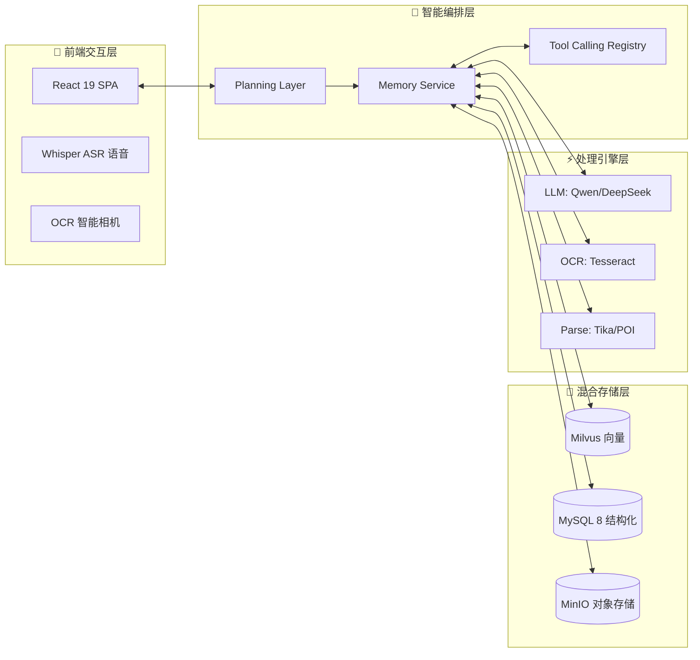

# 🏛️ Campus Digital AI Memory Engine (CDAME)
### —— 校园数字化记忆引擎：让校园记忆“活起来”

<div align="center">
  <p align="center">
    
    
    
    
  </p>
  <p align="center">
    <strong>基于 RAG 架构的多模态 AI 知识中枢，深度集成智能问答、文件溯源、荣誉体系与学业洞察。</strong>
  </p>
  <p align="center">
    <a href="#-项目愿景">项目愿景</a> •
    <a href="#-核心特性">核心特性</a> •
    <a href="#-技术架构">技术架构</a> •
    <a href="#-快速开始">快速开始</a> •
    <a href="#-安全合规">安全合规</a>
  </p>
</div>

---

## 🌟 项目愿景

在传统的高校信息化建设中，校史资料、荣誉档案、学生学业数据往往处于“孤岛”状态。**CDAME** 的核心使命是：
> **“重构校园记忆，赋予数据灵魂。”**

我们通过 AI 引擎，将分散在 PDF、图片、音视频、Excel 中的碎片化知识，编织成一张**可检索、可追溯、可交互**的数字记忆网络。

---

## 🛠️ 核心特性

### 1. 🧠 混合动力智能问答 (Hybrid RAG)
不仅是语义检索，更是“意图理解 + 数据调用”的深度结合。
- **语义召回**：基于 Milvus 向量数据库实现海量文档的精准匹配。
- **结构化洞察**：通过自然语言直接查询 MySQL 成绩数据（Score Tool）。
- **可信溯源**：返回 Trace 信息，清晰展示 AI 思考路径及引用文件。

### 2. 📄 多模态资源中枢
打破文件格式壁垒，实现全场景解析。
- **文档全解析**：PDF, Word, Excel, Markdown 深度文本提取。
- **OCR 视觉链路**：集成 Tesseract，支持拍照扫描、清晰度检测、反光门禁。
- **语音转写**：Whisper ASR 支持实时录音转写，让语音交互成为可能。

### 3. 🌲 荣誉叙事树 (Honor Tree)
将冷冰冰的荣誉名单转化为生动的时间轴与叙事流，支持：
- 荣誉事件自动聚合。
- 情感化叙事生成。
- 历史关联深度挖掘。

### 4. 📊 学生画像与学业洞察
基于大数据分析，为每位学生生成专属“数字镜像”：
- 专业维度多维分析。
- 成绩趋势预测与预警。
- 个性化 AI 助学建议。

---

## 🏗️ 技术架构

### 系统流图 (System Flow)


### 技术栈详情
| 维度 | 技术选型 | 核心价值 |
| :--- | :--- | :--- |
| **后端** | Spring Boot 3.2 + Java 17 | 企业级稳定性与高性能异步处理 |
| **AI 编排** | LangChain4j | 统一的模型抽象与工具链调用 |
| **前端** | React 19 + Vite + Tailwind | 极致的响应速度与现代 UI/UX |
| **向量数据库** | Milvus | 支持百万级 Embedding 的毫秒级召回 |
| **对象存储** | MinIO | 兼容 S3 协议，安全存储多媒体资产 |
| **OCR/ASR** | Tesseract / Whisper | 赋能多模态感知能力 |

---

## 🏁 快速开始

### 🚀 一键环境初始化 (Docker)
项目已预配置完整的中间件堆栈：
```bash
# 启动 MySQL, Milvus, MinIO
docker-compose up -d
```

### ⚙️ 极简配置 (.env)
在项目根目录创建 `.env` 文件，填入你的 AI 密钥：
```ini
# AI 配置
AI_CHAT_API_KEY=sk-xxxx
AI_CHAT_BASE_URL=https://dashscope.aliyuncs.com/compatible-mode/v1/

# 数据库密码
SPRING_DATASOURCE_PASSWORD=your_password
```

### 🛠️ 编译与运行
```bash
# 后端启动
./mvnw spring-boot:run

# 前端启动
cd cdame-front && npm install && npm run dev
```

---

## 🛡️ 安全合规与生产建议

> [!CAUTION]
> **生产环境安全加固清单：**
> 1. **鉴权升级**：默认账号 `admin/admin123` 仅供测试，上线前必须修改。
> 2. **数据隔离**：确保 `volumes/` 目录不进入 Git，生产环境建议开启 MinIO 加密。
> 3. **网络防御**：配置后端 CORS 白名单，中间件端口（3306, 19530）严禁外网映射。

---

## 🗺️ 路线图 (Roadmap)
- [x] 多模态 RAG 基础框架
- [x] 成绩洞察与工具链调用
- [x] 移动端智能扫描与质量门禁
- [ ] **Next:** 接入 Rerank 模型提升检索精度
- [ ] **Next:** 增加离线大模型本地化部署支持 (Ollama)
- [ ] **Next:** 完善知识图谱 (Knowledge Graph) 关联

---

<div align="center">
  
  
  <br>
  <sub>© 2026 AI Campus Memory Engine Team. 基于 Apache-2.0 协议开源。</sub>
</div>
